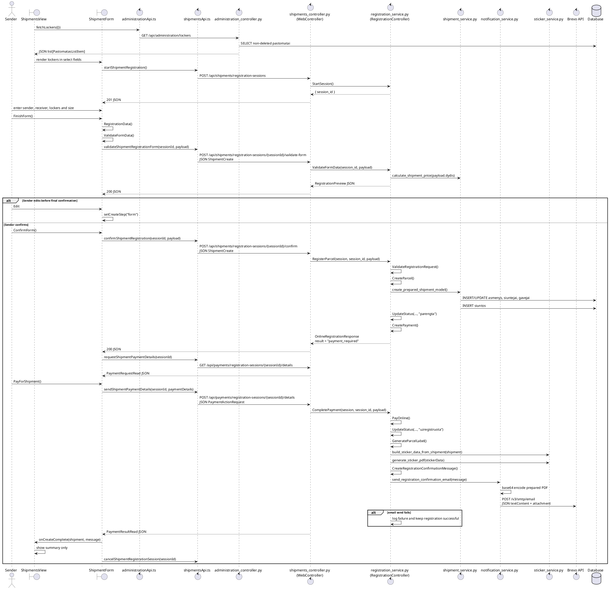
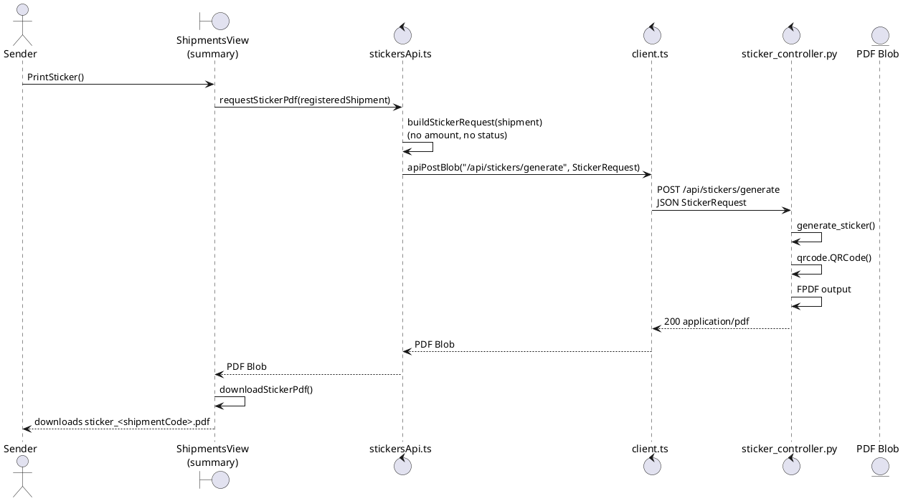
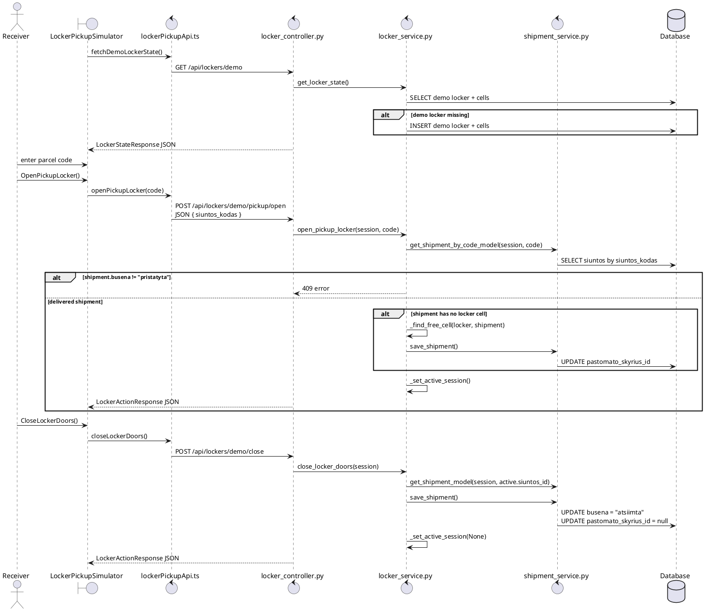

# Shipment Registration Sequence Diagrams

Siuntu posistemis dabar yra vartotojo registracijos ir atsiemimo langas, be CRUD sarasu.
Po puslapio refresh frontend busena prarandama ir vel rodoma nauja registracijos forma. Lokaliu
JSON failu siame sraute nera: JSON naudojamas HTTP request/response kunuose, o duomenys saugomi DB.

## 1. Siuntos registracija

Eiles tvarka:

1. `ShipmentsView` uzkrauna nepanaikintu pastomatu sarasa per `fetchLockers()`.
2. `ShipmentForm` rodo tik registracijos laukus: siunteja, gaveja, siuntimo/gavimo pastomatus ir dydi.
3. `FinishForm()` surenka `RegistrationData()`, validuoja `ValidateFormData()` ir kviecia backend formos perziurai.
4. Pries galutini patvirtinima vartotojas gali grizti i forma ir redaguoti duomenis.
5. `ConfirmForm()` sukuria siunta DB per `RegisterParcel()`.
6. Registracija visada pereina i online apmokejimo langa.
7. `PayForShipment()` patvirtina mokejima, sukuria lipduko PDF ir siuntejui issiuncia
   patvirtinimo el. laiska su `sticker_<shipmentCode>.pdf` prisegtuku.
8. Jei Brevo el. laisko siuntimas nepavyksta, klaida tik uzregistruojama serverio loge,
   o siuntos registracija lieka sekminga.
9. Po refresh summary dingsta, nes `registeredShipment` yra tik React state.

## 2. Lipduko atsisiuntimas is summary

## 3. Siuntos atsiemimas pagal koda

Eiles tvarka:

1. `LockerPickupSimulator` rodo kodo ivedimo lauka, ne siuntu sarasa.
2. `OpenPickupLocker()` kviecia `POST /api/lockers/demo/pickup/open`.
3. Backend leidzia atidaryti duris tik siuntai su busena `pristatyta`.
4. `CloseLockerDoors()` pakeicia busena i `atsiimta` ir isvalo pastomato skyriu.
